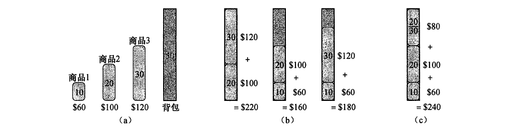

#贪心算法原理
贪心算法就是做出一系列选择来使原问题达到最优解。在每一个决策点，都是做出当前看来的最优选择，比如在活动选择问题里面，我们总是在一个问题的基础上选择结束时间最早的活动，之后再在剩下活动的基础上选出结束时间最早的活动，以此类推，直到没有活动可以进行选择。但是遗憾的是这种算法并不是总能得到最优解，并且是否能得到最优解还取决于对于贪心策略的选择。

一般来说，设计贪心算法涉及到下面几个步骤：
> 1.确定问题的最优子结构
> 2.基于问题的最优子结构设计一个递归算法
> 3.证明我们做出的贪心选择，只剩下一个子问题
> 4.证明贪心选择总是安全的
> 5.设计一个递归算法实现贪心策略
> 6.将贪心算法转化为迭代算法

比如在活动选择问题里面，我们就是确定了互动最优子结构的性质，我们在子问题$S_j$里面选出一个基于上次选择$a_j$的最早结束活动$a_m$，使得$S_j$的最优解是由$a_m$和$S_m$的最优解组成的。

更一般的来说，我们可以讲贪心算法的设计步骤简述为下面几部：
> 1.将最优化问题简化为这样的形式：最初一个选择以后，只剩下一个子问题需要求解！
> 2.证明在做出贪心选择以后，原问题总是存在最优解，即贪心选择总是安全的！
> 3.证明在做出贪心选择以后，剩下的子问题满足性质：其最优解与做出选择的组合在一起得到原问题的最优解，即最优子结构

---

##贪心算法的两大性质
贪心算法有两个重要的性质：
> - 贪心选择性质
> - 最优子结构性质

下面我们来详细讨论这两个性质
###贪心选择性质
第一个关键要素就是***贪心选择性质***:我们可以做出局部最优选择来构造最优解。也就是说，我们在做出选择时，总是以当前的情况为基础做出最优选择的，而不用考虑子问题的解！

这要是和动态规划最大的不同之处，我们知道
> - 在***动态规划***中，在每次做出一个选择的时候总是要将所有选择进行比较以后才能确定到底采用哪一种选择，而这种选择的参考依据是以子问题的解为基础的，所以动态规划总是采用自下而下的方法来，先得到子问题的解，再通过子问题的解构造原问题的解。就算是自上而下的算法也是先求出子问题的解，通过递归调用自下而上的返回每一个子问题的最优解
> - 在***贪心算法***中，我们总是在原问题的基础上做出一个选择，然后求解剩下的唯一子问题，贪心算法从来都不依赖子问题的解，不过有可能会依赖上一次做出的选择，所以贪心算法是自上而下的。一步一步的选择将原问题一步步消减得更小

当然，我们必须证明每一个步骤做出的贪心选择都可以生成全局最优解！我们再活动选择问题里面是这样的做的，首先假定有一个最优解，然后将做出的选择替换进去得到另外一个最优解！

###最优子结构
如果一个问题的最优解包含其子问题的最优解，那么就称这个问题具有最优子结构性质！我们知道最优子结构这个性质是动态规划和贪心算法都必须具备的关键性质。

##贪心算法vs动态规划
贪心算法和动态规划都有一些共同的性质，比如最优子结构，有些问题我们可以采用动态规划来解决，也可以采用贪心算法来结局，这两者之间有细微的差别！下面我们通过研究一个问题来区分之间的差别！
下面有两个经典的算法问题:
> - **0-1**背包问题：我们有一堆物品$S=\lbrace a_1,a_2,...,a_n \rbrace$,每一个物品$a_i$都有一个重量$w_i$和一个价值$v_i$.现在有一个背包，这个背包的容量为$W$,现在要将这些物品在不超出背包容量的情况下选择性的放入背包，使得背包里面物品的价值最大，物品不能只选取其中一部分，必须选择整个，或者不选！
> 
> - **分数**背包问题：这个问题和上面的问题比较相似，唯一不同的就是该问题里面的物品可以进行分割，即可以只选取一个物品$a_i$的一部分

虽然上面两个问题比较相似，但是贪心算法可以求解第二个问题而不能求解**0-1**背包问题，为了求解分数背包问题，我们首先得到每一个物品单位重量的价值$v_i/w_i$,那么我们要设计一个贪心策略来使得装入背包物品的价值最大。我们的第一直觉肯定是要选择单位重量价格最高的喽，让后再选择物品里面第二高的，一次类推直到装满背包为止！

下面我们来证明一下上面贪心选择的猜想：
>**证明:**
>
> 我们首先假设我们有一个最优解$A_1$,那么我们首先找到$A_1$里面平均价值最高的物品$a_m$，让后我们将用商品里面平均价值最高的物品$a_1$将$a_m$进行全部替换或者部分替换得到解$A_2$，又因$v_1/w_1 \geq v_m/w_m$所以$A_2$的总价值高于$A_1$的总价值，这$A_1$是最优解矛盾，于是得到$A_1$里面包含平均价值最高的物品。

于是我们得到最优子结构$S_i = S_k +a_k$，$a_k$是$S_i$里面平均价值最高的，$S_k$是选择$a_k$剩下来的物品。
为了说明这个贪心策略对**0-1**背包问题无效，我们采用下面的例子
> 我们有三个物品和一个容量为50的背包，这三个物品<重量,价值>分别为:$a1<10,60>,a2<20,100>,a3<30,120>$.

如果按照上面的贪心策略来选择的话，首先是选择$a1$,然后再选择$a2$再选择$a3$.但是这样做真的可以达到最大价值么？未见得：

所以上面的贪心选择将不能解决**0-1**背包问题，但是却可以完美的解决分数背包问题，那么**0-1**背包问题要怎么解决，因为这两个背包问题都有一个很重要的性质，那就是最优子结构，于是乎动态规划这个利器就要出手啦！
我们将在另外一篇文章里面介绍**0-1**背包问题和**分数**背包问题！

文章中难免有疏漏，望批评指正！
