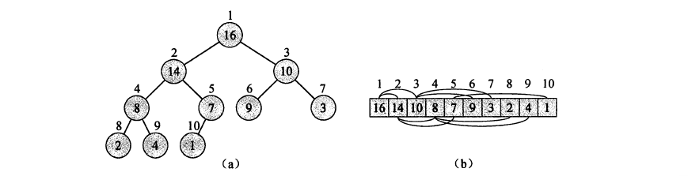
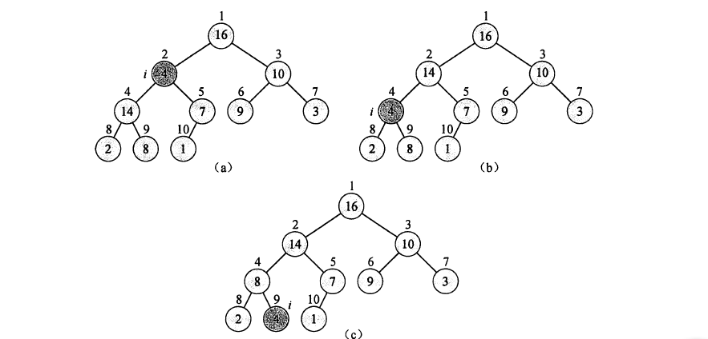

#堆

##堆的基本性质

**堆**也可以说是一个**完全二叉树**，就是除了最底层的，其它层是满的，既然我们可以用完全二叉树来表示一个堆，那么我们这里就采用数组结构的二叉树来阐述堆的性质。
假设在这里我们用数组A表示堆，A[i]表示堆里面的第i个元素，于是我们通过二叉树的性质可知:
- PARENT(i) = i/2
- LEFTCHILD(i) = 2*i
- RIGHTCHILD(i) = 2*i+1

就如下图表现所示：



>**小优化:**
>
>我们知道在计算机里面做乘法和除法是特别慢的。但是某些时候，我们就可以采用左移和右移来代替乘以2和除以2的操作，比如1<<2，那么就是2,4>>1，那么结果就是2，我们知道左移和右移的操作是非常迅速的。所以我们在计算父节点坐标和子节点坐标的时候可以采用这种方法来实现:
>```cpp
>#define PARENT(i) ((i)>>1)
>#define LEFTCHILD(i) ((i)<<1)
>#define RIGHTCHILD(i) ((i<<1)+1)
>```

##堆的分类
在堆里面，我们可以大致将堆分为三类
- 最小堆
- 最大堆
- 堆

###最小堆
只要在二叉树结构里面，对于除了根节点意外的任何节点i都满足:
$$
A[PARENT[i]] < A[i]
$$
那么就称具有这种性质的堆为**最小堆**


###最大堆
与最小堆类似，只要在二叉树结构里面，对于除了根节点意外的任何节点i都满足:
$$
A[PARENT[i]] > A[i]
$$
那么就称具有这种性质的堆为**最大堆**


###堆
对于即即使**最小堆**也不是**最大堆**的堆来说，这种对我们就称之为**堆**


##维护堆的性质
假如我们改变最大堆里面的一个元素的大小，那么整个最大堆的性质将会被破坏，这里我们需要找到一种在改变了最大堆或者是最小堆的元素的情况下，进行一定变换就可以保持堆原有性质的方法！
因为最大堆和最小堆基本类似，于是我们在这里选出最大堆进行讲解，我们假设维护最大堆性质的函数为MAX-HEAPIFY(A,i),这里输入需要维护的堆A和改变的元素位置i。<font color=red>在堆A进行维护之前，必须保证i节点的左子树LEFT(i)和右子树RIGHT(i)有最大堆的性质,这一点很重要</font>
下面我们用伪代码实现MAX-HEAPIFY(A,i)
```cpp
MAX-HEAPIFY(A,i)
if i >= A.heapsize
	return
leftChild = LEFTCHILD(i)
rightChild = RIGHTCHILD(i);
maxPos = i
if A[leftChild] > A[i]:
	maxPos = leftChild;
if A[rightChild] > A[maxPos]:
	maxPos = rightChild;
if(maxPos == i)
	return;
exchange(A,maxPos,i)
MAX-HEAPIFY(A,maxPos)
```

在这里，我们采用将元素沉降的方法，将较小的元素向下沉降，较大的元素向上移动，假设我们这里有这样一个例子：


假设以i为根节点一棵子树，现在我们要对其从根节点开始进行最大堆的性质维护，那么我们需要多大的时间花费呢
$$
T（n) \leq T(n2/3)+O(1) 
$$
>**证明:**
>假设我们有一棵完全二叉树$T$，这棵二叉树有$n$个节点，高度为$h+1$,那么在将根节点去掉以后左子树剩余节点数最多为：$(2^{h+1}-2)/2+2^h=2*2^h-1$($T$的最底层元素个数为$T$为满二叉树时最底层元素个数的一半)，，在去掉根节点以后，剩下的总结点个数为$2^{h+1}+2^h-1 = 3*2^h-1$ ,那么在在去掉根节点以后，左子树的节点数量与及剩下总节点个数相比为${2*2^h-1}\over {3*2^h-1}$,于是$ \displaystyle \lim_{h\to\infty}{{2*2^h-1}\over {3*2^h-1}}=\frac23 $

所以按照主定理，我们知道维护堆性质的时间代价为$O(logn)$

