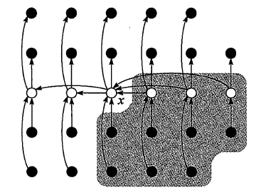

[TOC]

<font color=red>注：本文中的所有代码都在[这里](http://download.csdn.net/detail/ii1245712564/8733501)</font>
#选择算法
`选择算法`就是用来解决在一堆数里面选出第`k`大的数的问题。选择算法的设计方法有很多，比如将这堆数据先进行排序，然后取出对应的第`k`个元素就可以了，这种算法的平均运行时间为$O(nlogn)$,说慢不慢，说快也不快。我们将在后面的内容里面介绍一种在线性时间$O(n)$内就可以完成选择的算法。

在进入正题内容之前,先来介绍几个术语:

- **顺序统计量**:第$k$个顺序统计量就是在含有$n$个元素的序列里面找到第$k$大的元素.比如最小值是第一个顺序统计量，最大值是第$n$个顺序统计量
- **中位数**:中位数顾名思义就是找到序列里面排序在中间的那个数。序列元素个数$n$为基数的话，中位数就是第$(n+1)/2$个顺序统计量，若为偶数，中位数就有两个,一个是下中位数$n/2$,一个是上中位数$(n+2)/2$

#选择算法之选取最大数或最小数
选择一个序列里面的最大数或者是最小数是选择算法里面最简单的情形，即选择第一个顺序统计量或者选择最后一个顺序统计量。我们只要遍历一遍数组就可以选择出最大值或者最小值，运行时间为$\Theta(n)$,可以在线性时间之内完成最大数/最小数的选取。
##<font color=green>**选取最大数或最小数代码实现**</font>
这里实现了选择数组里面最小值的代码，读者可以以此类推自己写出选择最大值的算法
```cpp
/**
 * 找到最小的元素
 * @param  array     输入的数组
 * @param  arraySize 数组大小
 * @param  minNumber 输出最小值
 * @return           最小值在数组里面的位置
 */
size_t findMin(int array[] , int arraySize , int * minNumber)
{
    if(array == NULL || arraySize <= 0 || minNumber == NULL)
        return -1;
    int minPos = -1;
    int minNumberTemp=INT_MAX;
    for (int i = 0; i < arraySize; ++i)
    {
        if(array[i] < minNumberTemp)
        {
            minNumberTemp=array[i];
            minPos = i;
        }
    }
    *minNumber = minNumberTemp;
    return minPos;
}
```
>**运行结果**：
>
>input array is :
48	18	97	27	13	85	8	38	95	31	
find the min number 8 at pos 7

我们从代码里面可以看出`for`循环运行`n`次，每次都要进行一次比较`if(array[i] < minNumberTemp)`，如果我们标记的最小值大于当前的数组元素，就重新标记当前数组元素为最小值。因为这个代码比较简单，这里不再赘述。

#选择算法之选取最大数和最小数
条件改变，现在要选择一个序列里面的最大数和最小数，这里和上面讲述过的选择最大数或者最小数有所不同，上面的要做的只是选择最大值<font color=red>**或者**</font>最小值，而现在我们要<font color=red>**同时**</font>选择最大值<font color=red>**和**</font>最小值。

博主第一次看见这个题目时，和只选择最小数的情形一对比，这不是一样的么，只要在循环里面多加一个最大数的比较不就行了？的确是可以，我们来看一下部分代码实现
##<font color=blue>选取最大数和最小数代码实现</font>
```cpp
/**
 * 找到最小的元素
 * @param  array     输入的数组
 * @param  arraySize 数组大小
 * @param  minNumber 输出最小值
 * @return           最小值在数组里面的位置
 */
MinMaxPair findMinMax(int array[] , int arraySize , int * minNumber , int * maxNumber)
{
	/** 省略了一些代码 */
	for (int i = 0; i < arraySize; ++i)
    {
        if(array[i] < minNumberTemp)
        {
            minNumberTemp=array[i];
            minPos = i;
        }
        if(array[i] > maxNumberTemp)
        {
			maxNumberTemp = array[i];
			maxPos = i;
		}
    }
    /** 省略了一些代码 */
}
```
 
这里在一个循环里面要进行两次比较，于是运行时间为$2n$,虽然也是线性时间里面完成选择，但是常数项的开销明显变多了不少

##<font color="#9A32CD">选取最大数和最小数代码优化</font>
但是对于这个算法我们还是可以进行优化的，我们每次选出两个元素，首先对这两个元素进行对比，将其中小者与标记最小数进行比较，如果小者小于最小数，那么就替换最小数，将其中大者与最大数进行比较，如果大者大于最大数，就替换最大数，这样下来只需要循环$n/2$遍，每遍比较三次，于是运行时间为$3n/2$,比没有优化之前的代码节省了25%的运行时间
```cpp
/**
*记录最大值和最小值在数组里面的位置
*/
class MinMaxPair
{
public:
    MinMaxPair(int _minPos = -1 , int _maxPos = -1):minPos(_minPos),maxPos(_maxPos){}
    size_t minPos;// 最小值在数组里面得位置
    size_t maxPos;// 最大值在数组里面的位置
    bool operator==(const MinMaxPair & pair)
    {
        return (this->minPos == pair.minPos && this->maxPos == pair.maxPos);
    }
};  

/** 找到一个数组里面的最大值和最小值 */
MinMaxPair findMinMax(int array[] , int arraySize , int * minNumber , int * maxNumber)
{
    if(array == NULL || arraySize <= 0 || minNumber == NULL || maxNumber == NULL)
        return MinMaxPair();
	/** 奇数个元素设置，取出第一个元素作为初始的最大值和最小值 */
    int maxNumberTemp = array[0];
    int minNumberTemp = array[0];
    size_t maxPos=-1;
    size_t minPos=-1;
    int i = 1;
    if(arraySize%2 == 0)// 一共有偶数个元素，取出前两个元素，大的作为最大值的初始值，小的作为最小值的初始值
    {
        i=2;
        // 比较数组前两个元素
        maxNumberTemp = array[0];
        minNumberTemp = array[1];
        maxPos = 0;
        minPos = 1;
        if(array[0] < array[1])
        {
            maxNumberTemp = array[1];
            minNumberTemp = array[0];
            maxPos = 1;
            minPos = 0;
        }
    }
    for (; i < arraySize ; i+=2)
    {
	    /** 每次取出两个元素 */
        int temp1 = array[i];
        int temp2 = array[i+1];
        int tempPos1 = i;
        int tempPos2 = i+1;
        /** 比较两个取出的元素 */
        if(array[i] > array[i+1])
        {
            temp1 = array[i+1];
            temp2 = array[i];
            tempPos1 = i+1;
            tempPos2 = i;
        }
        /** 将小者与标识的最小值比较 */
        if(minNumberTemp > temp1)
        {
            minNumberTemp = temp1;
            minPos = tempPos1;
        }
		
		/** 将大者与标识的最大值比较 */
        if(maxNumberTemp < temp2)
        {
            maxNumberTemp = temp2;
            maxPos = tempPos2;
        }
    }
    // 最后设置输出的元素
    *maxNumber = maxNumberTemp;
    *minNumber = minNumberTemp;
    return MinMaxPair(minPos , maxPos);
}
```
>运行结果
>input array is :
69	72	82	53	61	35	43	74	83	76	
find the min number 35 at pos 6
find the max number 83 at pos 9

在上面的代码，如果输入数据的长度为奇数，我们就选取第一个元素作为最大值和最小值元素的初始值，并从数组的第二个元素开始每次选出两个元素；如果为偶数，那么取出前两个元素，大的作为最大值的初始值，小的作为最小值的初始值，并从第三个元素开始，每次取出两个元素

#快速选择算法
之前讨论的选择最大数和最小数都属于比较极端的情况，要是现在需要选择一个序列里面的第$k$个顺序统计量呢，有什么比较快速的方法呢？首先想到的就是排序以后再选取啦。不过排序的平均运行时间为$O(nlogn)$,相对于接下来介绍的**快速选择算法**是慢那么一个级别的。

##<font color="#43CD80">快速选择算法分析</font>
还记得之前讲过的[快速排序_QUICKSORT](http://blog.csdn.net/ii1245712564/article/details/45749061)么，快速选择算法就是运用了快速排序算法的思想,假设我们现在有一数组$A[left...right]$
1. 首选在数组$A$里面选取一个主元$M$
2. 遍历一遍数组(从left到right)，将比主元$M$大的元素放在主元的右边,小于等于主元的元素放在主元的左边，此时主元在数组中的位置为$i$。于是主元$M$就是数组里面的第$i$个顺序统计量
3. 比较主元位置$i$和目标顺序统计量$k$，如果$i = k$,就直接返回主元$M$;如果$k < i$,就更新$right = i-1$,转到动作(2)继续开始运行;如果$k > i$,那么就更新$left = i+1$,$k = i-left$,转到动作(2)继续开始运行。

就这样我们可以找到第$k$个目标顺序统计量，该操作的期望运行时间为$O(n)$

##<font color="#40E0D0">快速选择算法编码实现</font>
我们在这里采用两个方法来实现快速选择算法的实现，一个是迭代，一种是递归，两种算法实现的思想都一样，只是实现的方式不同而与

>**递归方式实现**
```cpp
/**
 * 找到数组里面第k大的元素
 * @param  array     输入的数组
 * @param  arraySize 数组大小
 * @param  kthNumber 第k大元素的大小         
 * @param  k         第k大的元素
 */
void randomizedSelect(int array[] , int arraySize , int * kthNumber , int k)
{
    if(array == NULL || arraySize <= 0 || kthNumber == NULL || k <0 || k >= arraySize)
        return;
    randomizedSelectKernel(array, 0 , arraySize-1 , kthNumber , k);
}


/**
 * 找到leftBorder到rightBorder中第k大的元素,递归函数
 * @param  array       输入的数组
 * @param  leftBorder  左边界
 * @param  rightBorder 右边界
 * @param  kthNumber   第k大的元素的实际值
 * @param  k           第k大的元素
 */
void randomizedSelectKernel(int array[], int leftBorder , int rightBorder ,int * kthNumber , int k)
{
    if(leftBorder > rightBorder)
        return ;
    // 这里采用快速排序的思想来完成
    int i = leftBorder-1;
    int j = leftBorder;
    int x = array[rightBorder];
    // 首先找到主元
    for(; j < rightBorder ; ++j)
    {
        if(array[j] <= x)
        {
            exchange(array , j , ++i);
        }
    }
    ++i;
    exchange(array , i , rightBorder);
    // 现在位置i就是需要放置主元的地方
    if(i == leftBorder+k-1)
        *kthNumber = array[i];
    else if(i > leftBorder+k-1)
        randomizedSelectKernel(array , leftBorder , i-1 , kthNumber , k);
    else if(i < leftBorder+k-1)
        randomizedSelectKernel(array , i+1, rightBorder , kthNumber , k-(i-leftBorder+1));
}
```
>**运行结果**
>input array is :
96	47	95	38	53	45	3	92	20	73	
2th max number is---------------------- 20
3	20	45	38	47	53	73	92	96	95	
1th max number is---------------------- 3
3	20	45	38	47	53	73	92	96	95	
3th max number is---------------------- 38
3	20	38	45	47	53	73	92	96	95	
6th max number is---------------------- 53
3	20	38	45	47	53	73	92	96	95	

---
>**迭代方式实现**

```cpp
/**
 * 找到数组里面第k大的元素
 * @param  array     输入的数组
 * @param  arraySize 数组大小
 * @param  kthNumber 第k大元素的大小         
 * @param  k         第k大的元素
 */
void randomizedSelect(int array[] , int arraySize , int * kthNumber , int k)
{
    if(array == NULL || arraySize <= 0 || kthNumber == NULL || k <0 || k >= arraySize)
        return;
    int left = 0;
    int right = arraySize-1;
    int kTemp = k;
    while(left <= right)
    {
        // 采用快速排序的思想
        // 首先找到主元
        int i = left-1;
        int j = left; 
        int x = array[right];
        for(; j < right ; ++j)
        {
            if(array[j] <= x)
            {
                exchange(array , ++i , j);
            }
        }
        ++i;
        exchange(array , i , right);
        /** 现在位置i就是主元位置 */
        if(i == kTemp+left-1)// 找到第k大的元素
        {
            *kthNumber = array[i];
            return;
        }
        else if (i<kTemp+left-1)
        {
            kTemp = kTemp-(i-left+1);
            left = i+1;
        }
        else if(i > kTemp+left-1)
        {
            right = i-1;
        }
    }
}
```
>**运行结果**:
>input array is :
62	66	70	54	74	98	83	52	80	19	
2th max number is---------------------- 52
19	52	54	62	74	98	83	70	80	66	
1th max number is---------------------- 19
19	52	54	62	66	98	83	70	80	74	
3th max number is---------------------- 54
19	52	54	62	66	98	83	70	80	74	
6th max number is---------------------- 70
19	52	54	62	66	70	74	98	80	83	

##<font color="#4876FF">快速选择算法代码优化</font>
细心的读者可能已经发现，我们在一遍一遍对一个数组进行选择的过程中，数据已经慢慢变的有序起来，我们一开始的输入数组为`62	66	70	54	74	98	83	52	80	19`,在进行了四遍选择以后，发现数组已经被更新为`19	52	54	62	66	70	74	98	80	83	`,接近有序了。我们知道有序数组对于快速算法是致命的，如果不对快速算法做任何优化，那么快速算法将会达到最差运行时间$O(n^2)$，因为有序的数据将会导致快速排序的分组极度不平衡。

快速选择算法里面也是一样的，应该避免输入有序数组导致的分组极度不平衡的情况，所以我们就做了下面的优化，在进行快速选择之前，首先从数组的头部，中部，尾部选出三个元素出来，找出这三个元素中第二大的元素，并与数组的最后一个元素进行交换，这样我们就可以避免分组极度不平衡的情况了，但是只是能保证避免分组极度不平衡的情况，还是有可能分组不平衡的,下面我们要讲解的`BFPRT选择算法`可以很好的做到平衡分组

我们在每次迭代或者递归进行之前加上下面的代码
```cpp
/** 省略了好多代码 */
if(leftBorder > rightBorder)
        return ;
    // 这里采用快速排序的思想来完成
    // 为了避免最差的情况发生
    int mid=(leftBorder+rightBorder)/2;
    int midPos = rightBorder;
    // mid元素是第二大的
    if((array[leftBorder] > array[mid] && array[mid] > array[rightBorder]) ||\
    (array[leftBorder] < array[mid] && array[mid] < array[rightBorder]) )
        midPos = mid;
    // left元素是第二大的
    else if((array[mid] > array[leftBorder] && array[leftBorder] > array[rightBorder]) ||
            (array[mid] < array[leftBorder] && array[leftBorder] < array[rightBorder]) )
        midPos = leftBorder;
    if(midPos != rightBorder)
        exchange(array , midPos , rightBorder);

    int i = leftBorder-1;
    int j = leftBorder;
 /** 省略了好多代码 */
```

#BFPRT选择算法
上面我们讲过，在快速排序算法里面如果主元选择的不合适，将会导致快速排序算法的分组极度不平衡，这样大大降低了快速选择算法的效率

1973 年，`Blum`、`Floyd`、`Pratt`、`Rivest`、`Tarjan`一起发布了一篇名为 “_Time bounds for selection_” 的论文，给出了一种在数组中选出第$k$大元素平均复杂度为$O(n)$的算法，俗称**"中位数之中位数算法"**。这个算法依靠一种精心设计的 pivot 选取方法，即选取中位数的中位数作为主元，从而保证了在最情况下的也能做到线性时间的复杂度，打败了平均$O(nlogn)$、最坏 $O(n^2)$ 复杂度的快速排序算法

##<font color="#EEEE00">BFPRT选择算法主元选择</font>
其实这个算法的最精妙之处在于主元的寻找，该算法可以找到一个主元使得快速排序分组足够平衡

1. 判断元素个数是否大于五个，如果是，就跳转到步骤(2)，否则就对数组进行排序，如果元素个数为奇数，就返回中位数，若为偶数，就返回下中位数
2. 将数组进行分组，每组元素里面的元素各个均为五个，至多有一个数组的元素个数小于五个
3. 将每组元素进行插入排序(元素个数较少的情况下，插入排序性能还是不错的)
4. 把每一组里面的中位数取出来，就是五个元素里面的第三个；对于不满五个元素的组，如果元素个数为奇数，就取中位数，若为偶数，就取下中位数
5. 对取出来的中位数组成一个新的数组，并转到步骤(1),开始对取出来的中位数数组取中位数


上图中有五个个数为五的组和一个个数为三的组，白色空心点表示每一组的中位数，元素`x`表示每一组中位数里面的中位数，并且箭头从较大的元素指向较小的元素。

##<font color="#EE5C42">BFPRT选择算法性能分析</font>
每组五个元素，我们对数组进行分组最后会得到$n/5$个组。，除去不满五个元素和包括主元$x$的组，至少有$3\times(\frac n5-2) \geq \frac {3n}{10}-6$个元素是大于$x$的，类似的，至少有$\frac {3n}{10}-6$个元素小于$x$的，于是在每次分组中，两个组最不平衡的情况的也就是$7:3$,于是得到递归式,这里140是随便选取的一个常数
$$
T(n)=
\begin{cases}
O(1) & , n < 140\\
T(\frac n5) + T(\frac {7n}{10} +6) +O(n) & , n \geq 140
\end{cases}
$$

计算上式可以得知运行时间为$O(n)$

##<font color="#EE7AE9">BFPRT选择算法代码实现</font>
```cpp
/**
 * 找到数组中的中位数
 * @param  array       输入的数组
 * @param  lefyBorder  数组左边界
 * @param  rightBorder 数组右边界
    const int & arraySize = rightBorder - leftBorder+1;
 * @return             中位数的坐标
 */
int BFPRT(int array[] , int leftBorder , int rightBorder)
{
    if(array == NULL || leftBorder > rightBorder )
        return -1;
    const int & arraySize = rightBorder - leftBorder +1;
    // 判断元素的个数是否大于五个
    if(arraySize <= 5)
    {
        insertSort(array , arraySize);
        return leftBorder+arraySize/2;
    }
    // 如果元素个数大于五个，那么就五五分组
    const int & groupSize = 5;
    int * groupStart=array;
    int midCount=0;
    for (int i = leftBorder+groupSize; i <= rightBorder; i+=groupSize)
    {
        insertSort(groupStart , groupSize);
        exchange(array , leftBorder+midCount , i-3 );//将中位数放在数组的最前面
        ++midCount;
        groupStart+=groupSize;
    }
    // 剩下的不满五个进行排序
    if(arraySize%groupSize != 0)
    {
        insertSort(groupStart , arraySize%groupSize);
        exchange(array , leftBorder+midCount ,leftBorder + arraySize - arraySize%groupSize + (arraySize%groupSize - 1)/2);
        ++midCount;
    }
    // 现在新选出来的所有中位数都在前midCount里面
    // 返回中位数的中位数
    return BFPRT(array , leftBorder , leftBorder+midCount-1);
}

/**
 * 选择第K大的元素
 * @param array       输入的数组
 * @param leftBorder  左边界
 * @param rightBorder 右边界
 * @param k           第k个
 * @param kthNumber   第k大的数
 */
void BFPRTselect(int array[] , int leftBorder , int rightBorder ,int k ,  int * kthNumber)
{
    if(array == NULL || leftBorder > rightBorder || kthNumber == NULL || k >(rightBorder - leftBorder + 1))
        return ;
    /** 选取主元 */
    int index = BFPRT(array , leftBorder , rightBorder);
    if(index == -1)
        return;
    cout<<"lefy--->"<<leftBorder<<" right--->"<<rightBorder<<" index:"<<index<<" midNumber :"<<array[index]<<endl;
    exchange(array , index , rightBorder);
    int i = leftBorder-1;
    int j = leftBorder;
    int x = array[rightBorder];

    for(; j < rightBorder ; ++j)
    {
        if(array[j] <= x)
        {
            exchange(array , ++i , j);
        }
    }
    ++i;
    exchange(array , i , rightBorder);
    if(i == leftBorder+k-1 )
    {
        *kthNumber = array[i];
        return ;
    }
    else if(i < leftBorder+k-1)
    {
        BFPRTselect(array , i+1 ,rightBorder , k-(i - leftBorder+1) , kthNumber);
    }
    else if(i > leftBorder+k-1)
    {
        BFPRTselect(array , leftBorder , i-1 , k , kthNumber);
    }
}
```
>**运行结果**:
>before sort the array:
75	84	30	35	77	60	75	32	64	2
lefy--->0 right--->9 index:0 midNumber :75
lefy--->0 right--->6 index:1 midNumber :32
lefy--->0 right--->1 index:1 midNumber :30
2th max number is---------------------- 30
>
2	30	32	60	75	64	35	75	84	77	
lefy--->0 right--->9 index:0 midNumber :32
lefy--->0 right--->1 index:1 midNumber :2
1th max number is---------------------- 2
>
2	30	32	60	75	64	35	75	84	77	
lefy--->0 right--->9 index:0 midNumber :32
3th max number is---------------------- 32
>
30	2	32	60	75	64	35	75	84	77	
lefy--->0 right--->9 index:0 midNumber :32
lefy--->3 right--->9 index:4 midNumber :84
lefy--->3 right--->8 index:4 midNumber :75
lefy--->3 right--->6 index:5 midNumber :35
lefy--->4 right--->6 index:5 midNumber :75
lefy--->4 right--->5 index:5 midNumber :60
lefy--->5 right--->5 index:5 midNumber :64
6th max number is---------------------- 64
2	30	32	35	60	64	75	75	77	84	
>
after sort the array:
2	30	32	35	60	64	75	75	77	84	

